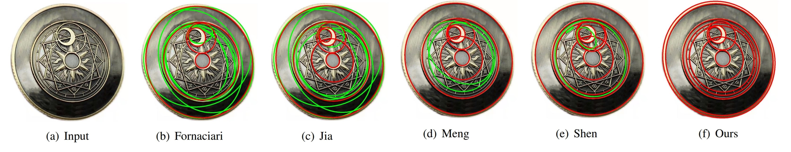

<p align="center">
  <p align="center">
    <h1 align="center">EDSF: Fast and Accurate Ellipse Detection via Disjoint-set Forest</h1>
  </p>
  <p align="center" style="font-size:16px">
    <a target="_blank" href="https://xiaowuga.github.io/"><strong>Jingen Jiang</strong></a>
    ·
    <a target="_blank" href="https://zikai1.github.io/"><strong>Mingyang Zhao</strong></a>
    ·
    <a target="_blank" href="https://github.com/meiyy"><strong>Zeyu Shen</strong></a>
   ·
    <a target="_blank" href="https://sites.google.com/site/yandongming/"><strong>Dong-Ming Yan</strong></a>
  </p>



This repository contains the official implementation of our ICME 2022 paper "EDSF: Fast and Accurate Ellipse Detection via Disjoint-set Forest".

## Platform
- Windows 11
- CLion2024.1.2 +  Visual Stdio 2022
- Intel(R) Core i9-13900K

## Dependence

The dependent libraries of our code includes:
- OpenCV (4.8.0 or later)
- cli11 (2.4.0 or later), command line.

We recommend using [vcpkg](https://github.com/microsoft/vcpkg) to install dependent libraries.
```shell
# OpenCV
vcpkg install opencv4:x64-windwos
# cli11
vcpkg install cli11:x64-windows
```

## How to build

Building our code in CLion:
```
# File -> Setting -> Build, Execution, Deployment -> CMake -> CMake Option :
-DCMAKE_TOOLCHAIN_FILE=${YOUR_VCPKG_INSTALL_PATH}/scripts/buildsystems/vcpkg.cmake
```
Making sure that your following settings are correct:
- Toolchains : `Visual Stdio`
- Architecture : `amd64`
- Build Type : `release`

## Contact
If you have any problem, please contact us via  <xiaowuga@gmail.com>. We greatly appreciate everyone's feedback and insights. Please do not hesitate to get in touch!

## Citation
Please consider citing our work if you find it useful:

```bibtex
@inproceedings{jiang2022edsf,
  title={EDSF: Fast and accurate ellipse detection via disjoint-set forest},
  author={Jiang, Jingen and Zhao, Mingyang and Shen, Zeyu and Yan, Dong-Ming},
  booktitle={2022 IEEE International Conference on Multimedia and Expo (ICME)},
  pages={1--6},
  year={2022}
}
```

# License
EDSF is under AGPL-3.0, so any downstream solution and products (including cloud services) that include EDSF code inside it should be open-sourced to comply with the AGPL conditions. For learning purposes only and not for commercial use. If you want to use it for commercial purposes, please contact us first.

## Acknowledgements

This work was partially supported by the the National  Natural Science Foundation of China (No. 62172415) and the Open Research Fund Program of State Key Laboratory of Hydroscience and Engineering (sklhse-2022-D-04).

